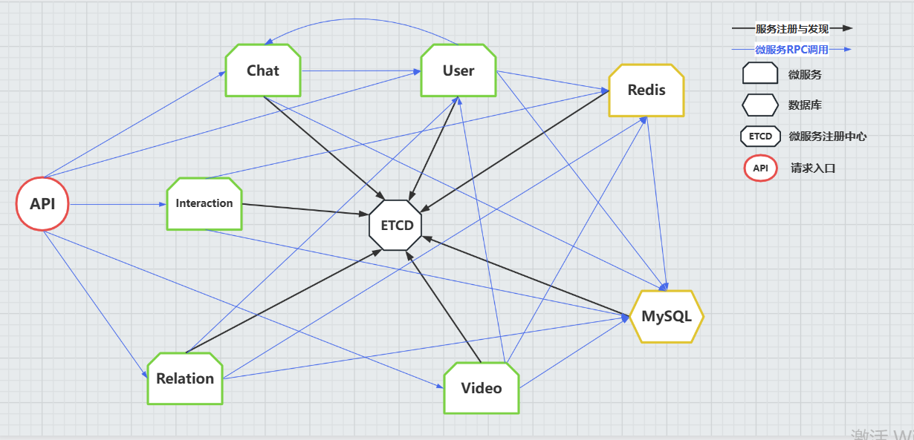

# Simple_douyin README

## 项目架构：
### 服务简介
该项目实现一款极简版抖音应用后台功能，主要采用了微服务架构对服务进行解耦。主要实现了以下功能：
1. 用户注册及登陆鉴权。
2. 视频流推送。
3. 用户点赞及评论，查看评论信息等互动功能。
4. 用户互相关注，用户关系管理等相关功能。
5. 好友间进行即时通信，消息缓存及在线推送等功能。 
   
项目的解耦后的7个微服务功能与技术特征见下表：

| 服务名称      | 服务功能              |  代码框架    |数据传输协议  | 服务路径      |  IDL             |
|--------------|----------------------|-------------|-------------|-------------|-----------------|
| Api          | HTTP interface       | hertz | http   | cmd/api     | ------  |
| User         | 用户信息管理           | kitex/gorm    | protobuf3      | cmd/user    | idl/user.proto |
| Redis        | 缓存热点数据           |  kitex/gorm   | protobuf3      | cmd/redis   | idl/redis.proto |
| Relation     | 管理用户关系 | kitex/gorm  | protobuf3      | cmd/relation    | idl/relaton.proto |
| Chat    | 用户通信服务 | kitex/gorm  | protobuf3      | cmd/chat    | idl/chat.proto |
| Interaction    | 视频互动服务 | kitex/gorm  | protobuf3      | cmd/interaction    | idl/interaction.proto |
| Video   | 视频流推送 | kitex/gorm  | protobuf3      | cmd/video    | idl/video.proto |

### 微服务调用关系



## 应用技术点：

- kitex: 
微服务通信框架，生成微服务调用API及协议
- hertz: 
   Golang 微服务 HTTP 框架，具有高易用性、高性能、高扩展性等特点
- gorm: 
访问数据库接口服务
- redis: 
  缓存热点数据、减少 I/O；比如视频点赞数、作品数、粉丝数、关注数等用户更新较多的数据存放在redis，并且在 redis 中进行更新，减少访问数据库的 I/O 开销；同时这些数据使用 redis 有序集合 ZSET 存储，后续需要排行榜功能，可以直接调用 redis API；
- jaeger:  访问地址：http://localhost:16686/search
跨进程追踪（cross-process）：调用另一个微服务
数据库追踪
进程内部的追踪（in-process）：在一个函数内部的追踪
- docker: 
  Docker 是一个轻量级的容器，的启动时间只需要一秒钟，从而大大的减少了开发、测试和部署的时间。轻松部署和扩展.
- jwt: 
  登录认证; JSON Web Token（JWT）是一个轻量级的认证规范，这个规范允许我们使用 JWT 在用户和服务器之间传递安全可靠的信息。其本质是一个 token ，是一种紧凑的 URL 安全方法，用于在网络通信的双方之间传递。
- minio: 
用户上传视频、头像等二进制数据，使用 minio 对其进行转换，生成 url；An object 是二进制数据，有时也称为 Binary 大对象 (BLOB)。 Blob 可以是图像、音频文件、电子表格，甚至 二进制可执行代码。 像 MinIO 这样的对象存储平台提供了专用的 用于存储、检索和搜索 blob 的工具和功能。


## 项目结构：

主要文件如下：

|                             Dir                              |                         Introduction                         |
| :----------------------------------------------------------: | :----------------------------------------------------------: |
| [**cmd**](https://github.com/gitgou/simple_douyin/tree/master/cmd) |                   API 网关、微服务代码文件                   |
| **[data](https://github.com/gitgou/simple_douyin/tree/master/data)** |                   保存用户上传的视频源文件                   |
| [**idl**](https://github.com/gitgou/simple_douyin/tree/master/idl) |    proto、 thrift 文件，用于生成微服务 API、数据传输协议     |
| **[kitex_gen](https://github.com/gitgou/simple_douyin/tree/master/kitex_gen)** |                  kitex 工具生成的微服务 API                  |
| [**minio**](https://github.com/gitgou/simple_douyin/tree/master/minio) |            记录对象存储meta数据 ：视频转化为 url             |
| [**pkg**](https://github.com/gitgou/simple_douyin/tree/master/pkg) | 数据库创建表格 sql 文件、中间件 middleware、trace、常量 constants、错误机制 errno、工具函数 utils |
| [**tools**](https://github.com/gitgou/simple_douyin/tree/master/tools) |    保存项目中用到的第三方工具及配置文件，比如 redis.conf     |
| **[docker-compose.yml](https://github.com/gitgou/simple_douyin/blob/master/docker-compose.yml)** |                       docker 启动文件                        |


### 微服务代码结构， 以 [user](https://github.com/gitgou/simple_douyin/tree/master/cmd/user) 微服务为例 （其它微服务结构类似）：

|                             File                             |                         Introduction                         |
| :----------------------------------------------------------: | :----------------------------------------------------------: |
| **[Makefile](https://github.com/gitgou/simple_douyin/blob/master/cmd/user/Makefile)** |                记录 kitex 生成微服务接口命令                 |
| **[cache ](https://github.com/gitgou/simple_douyin/tree/master/cmd/user/cache)** | 登陆用户数据记录于内存，数据定时入库，用户数据修改前先查找cache层，再查数据库曾，减少数据库 I/O次数； |
| **[dal](https://github.com/gitgou/simple_douyin/tree/master/cmd/user/dal)** |              数据库操作接口，用于 user 增删改查              |
| **[handler.go](https://github.com/gitgou/simple_douyin/blob/master/cmd/user/handler.go)** |                        user 服务接口                         |
| **[main.go](https://github.com/gitgou/simple_douyin/blob/master/cmd/user/main.go)** |                    user 服务主函数入口；                     |
| **[pack](https://github.com/gitgou/simple_douyin/tree/master/cmd/user/pack)** |  用于数据打包，转化；比如数据库访问 model 转化为 proto格式   |
| **[rpc](https://github.com/gitgou/simple_douyin/tree/master/cmd/user/rpc)** |                      调用其它微服务接口                      |
| **[service](https://github.com/gitgou/simple_douyin/tree/master/cmd/user/service)** |                         服务逻辑处理                         |


## Quick Start：

### 1. Setup Basic Dependence:

```sh
docker-compose up # 执行前，注意把 tools 里面的 redis.conf 文件放到 docker-compose.yml 中配置的redis配置文件路径下
```

### 2. Run Redis RPC Service :

```sh
cd cmd/redis
sh build.sh
sh output/bootstrap.sh
```

### 3. Run User RPC Server :

```sh
cd cmd/user
sh build.sh
sh output/bootstrap.sh
```

### 4. Run Video RPC Server:

```sh
cd cmd/video
sh build.sh
sh output/bootstrap.sh
```

### 5. Run Relation RPC Server:

```sh
cd cmd/relation
sh build.sh
sh output/bootstrap.sh
```

### 6. Run Chat RPC Server:

```sh
cd cmd/chat
sh build.sh
sh output/bootstrap.sh
```

### 7. Run Server:

```sh
cd cmd/...
sh build.sh
sh output/bootstrap.sh
```

### 8. Run API Server

```sh
cd cmd/api
./run.sh
```

### 9.Jaeger

visit `http://127.0.0.1:16686/` on browser.


## 测试 API:

以下是对应用对外部提供的API的一些测试结果。
### 基础接口

#### 视频流接口

```shell
curl --location --request GET '127.0.0.1:8080/douyin/feed/' \
--header 'Content-Type: application/json' \
--data-raw '{
  "latest_time" :
  "token"
}'
```


#### 用户注册

```shell
curl --location --request POST '127.0.0.1:8080/douyin/user/register/' \
--header 'Content-Type: application/json' \
--data-raw '{
  "username":"lorain",
  "password":"123456"
}'
```


#### 用户登录

```shell
curl --location --request POST '127.0.0.1:8080/douyin/user/login/' \
--header 'Content-Type: application/json' \
--data-raw '{
  "username":"lorain",
  "password":"123456"
}'
```


#### 用户信息

```shell
curl --location --request GET '127.0.0.1:8080/douyin/user/' \
--header 'Content-Type: application/json' \
--data-raw '{
  "user_id":"lorain",
  "token":"123456"
}'
```


#### 视频投稿

```shell
curl --location --request POST '127.0.0.1:8080/douyin/publish/action/' \
--header 'Content-Type: application/json' \
--data-raw '{
  "data":"lorain",
  "token":"123456",
  "title":"zzzzz"

}'
```


#### 发布列表

```shell
curl --location --request GET '127.0.0.1:8080/douyin/publish/list/' \
--header 'Content-Type: application/json' \
--data-raw '{
  "token":"123456",
  "user_id":"1111545"

}'
```


### 互动接口

#### 点赞操作

```shell
curl --location --request POST '127.0.0.1:8080/douyin/favorite/action/' \
--header 'Content-Type: application/json' \
--data-raw '{
  "token":"123456",
  "video_id":"1111545",
  "action_type":"1"

}'
```


#### 喜欢列表


```shell
curl --location --request GET '127.0.0.1:8080/douyin/favorite/list/' \
--header 'Content-Type: application/json' \
--data-raw '{
  "user_id":"1111545",
  "token":"123456",

}'
```


#### 评论操作


```shell
curl --location --request POST '127.0.0.1:8080/douyin/comment/action/' \
--header 'Content-Type: application/json' \
--data-raw '{
  "token":"123456",
  "video_id":"1111545",
  "action_type":"1",
  "comment_text":"test",
  "comment_id":"546",

}'
```


#### 评论列表


```shell
curl --location --request GET '127.0.0.1:8080/douyin/comment/list/' \
--header 'Content-Type: application/json' \
--data-raw '{
  "token":"123456",
  "video_id":"1111545",
}'
```

### 社交接口

#### 关注操作


```shell
curl --location --request POST '127.0.0.1:8080/douyin/relation/action/' \
--header 'Content-Type: application/json' \
--data-raw '{
  "token":"123456",
  "to_user_id":"1111545",
  "action_type":"1"
}'
```

#### 关注列表


```shell
curl --location --request GET '127.0.0.1:8080/douyin/relation/follow/list/' \
--header 'Content-Type: application/json' \
--data-raw '{
  "user_id":"1111545",
  "token":"123456",
}'
```

#### 粉丝列表


```shell
curl --location --request GET '127.0.0.1:8080/douyin/relation/follower/list/' \
--header 'Content-Type: application/json' \
--data-raw '{
  "user_id":"1111545",
  "token":"123456",
}'
```

#### 好友列表


```shell
curl --location --request GET '127.0.0.1:8080/douyin/relation/friend/list/' \
--header 'Content-Type: application/json' \
--data-raw '{
  "user_id":"1111545",
  "token":"123456",
}'
```


#### 发送消息


```shell
curl --location --request POST '127.0.0.1:8080/douyin/message/action/' \
--header 'Content-Type: application/json' \
--data-raw '{
  "token":"123456",
  "to_user_id":"1111545",
  "action_type":"1",
  "content":"douyin"
}'
```


#### 聊天记录


```shell
curl --location --request GET '127.0.0.1:8080/douyin/message/chat/' \
--header 'Content-Type: application/json' \
--data-raw '{
  "token":"123456",
  "to_user_id":"1111545",
}'
```


##项目设计优化：
  热门用户数据会被拉到内存中，更新依赖于内存，但会实时定时更新入库，访问数据可以直接从内存中获取，减少 I/0 开销；
  利用redis缓存热点数据；比如视频点赞数、作品数、粉丝数、关注数等用户更新较多的数据存放在了 redis，并且在 redis 中进行更新，减少访问数据库的 I/O 开销；同时这些数据使用 redis 有序集合 ZSET 存储，后续需要排行榜功能，可以直接调用 redis API；
  
##未来优化考虑：
- **数据库分库设计**
  用多数据库保存服务数据，解决高并发场景问题：
  - 大量请求阻塞：在高并发场景下，大量请求都需要操作数据库，导致连接数不够了，请求处于阻塞状态。
  - SQL 操作变慢：如果数据库中存在一张上亿数据量的表，一条 SQL 没有命中索引会全表扫描，这个查询耗时会非常久，开启慢查询日志。
  - 存储出现问题 ：业务量剧增，单库数据量越来越大，给存储造成巨大压力。
- **redis** 
  - 当前 redis 还是用的是单 redis client,为了提高并发效率，改进优化为 redis连接池
  - redis 集群部署，提高 redis 高可用
- **负载均衡机制**
  - 各微服务进行服务器横向扩展，提高并发率；使用一致性哈希等负载均衡算法，将各微服务的服务请求依照权重等因素，分给各服务器；
- **消息队列**
   - 各服务间添加消息队列，各服务间解耦，减少数据丢失

